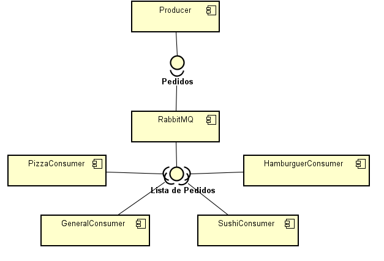

# RabbitMQ Restaurant

## Descrição

O projeto "RabbitMQ Restaurant" é uma aplicação que simula um sistema de gerenciamento de pedidos para um restaurante utilizando RabbitMQ como broker de mensagens. A aplicação é composta por um produtor que envia pedidos e um consumidor que processa esses pedidos. O objetivo é demonstrar o uso de comunicação assíncrona entre diferentes partes de um sistema.

## Estrutura do Projeto

- **Producer**: Envia mensagens de pedidos para diferentes filas.
- **Consumer**: Escuta as filas e processa os pedidos recebidos.

## Tecnologias Utilizadas

- **Java**: Linguagem de programação utilizada para o desenvolvimento.
- **RabbitMQ**: Broker de mensagens utilizado para gerenciar a comunicação entre o produtor e o consumidor.
- **Maven**: Gerenciador de dependências e construção do projeto.

## Requisitos

- Java 17
- Maven 3.6.0 ou superior
- RabbitMQ instalado e em execução

## Instalação

1. Clone o repositório:
   git clone https://github.com/PUC-DISCIPLINAS/rabbit-mq-arthurcbretas.git

2. Navegue até o diretório do projeto:
    cd rabbit-mq-restaurant

3. Compile o projeto e baixe as dependências:
    mvn clean install

## Execução
### Passos para executar o sistema:

1. Iniciar os Consumers:

- Execute os arquivos PizzaConsumer.java, HamburguerConsumer.java, SushiConsumer.java e GeneralConsumer.java na IDE de sua escolha.
- Cada consumer representará uma cozinha especializada, responsável por processar pedidos específicos.

2. Iniciar o Producer:

- Execute o arquivo Producer.java na mesma IDE ou em outra de sua preferência.
- O Producer será responsável por gerar e enviar 10 pedidos aleatórios para as cozinhas (consumers).

3. Processamento de Pedidos:

- Após o Producer ser iniciado, ele enviará pedidos para a fila, que serão distribuídos entre as cozinhas.
- Cada consumer processará os pedidos de acordo com sua especialização (Pizza, Hambúrguer, Sushi ou Geral) em tempo real.

4. Monitoramento dos Resultados:

- Cada execução (tanto do Producer quanto dos Consumers) exibirá as informações no terminal da IDE.
- Acompanhe no terminal os pedidos recebidos e processados por cada cozinha, bem como o tempo necessário para conclusão

## Filas e Tópicos

A comunicação entre o produtor e o consumidor é gerenciada através de filas e tópicos no RabbitMQ. Veja abaixo as principais filas utilizadas no projeto:

### Filas de Mensagens

As seguintes filas são utilizadas para receber pedidos específicos:

- **`refeicao.pizza`**: Fila dedicada ao processamento de pedidos de pizza.
- **`refeicao.hamburger`**: Fila dedicada ao processamento de pedidos de hambúrguer.
- **`refeicao.sushi`**: Fila dedicada ao processamento de pedidos de sushi.
- **`refeicao.salada`**: Fila dedicada ao processamento de pedidos de salada.
- **`refeicao.tacos`**: Fila dedicada ao processamento de pedidos de tacos.

### Tópicos

Os tópicos são utilizados para permitir uma comunicação mais flexível entre os módulos do sistema. No projeto, cada fila está associada a um tópico específico, permitindo que o consumidor escute mensagens relacionadas a diferentes tipos de pedidos de forma assíncrona. Essa abordagem facilita a escalabilidade e a manutenção do sistema, uma vez que novos tipos de pedidos podem ser facilmente adicionados.

## Diagrama de Componentes

## Observações de Segurança

- Durante o desenvolvimento, ocorreram mensagens de aviso relacionadas ao SSL, para ser menos incômodo foi feita a ocultação dos WARNINGS relacionados para não poluir o terminal. Para ambientes de produção, é recomendável usar certificados válidos e configurar a validação de certificados.